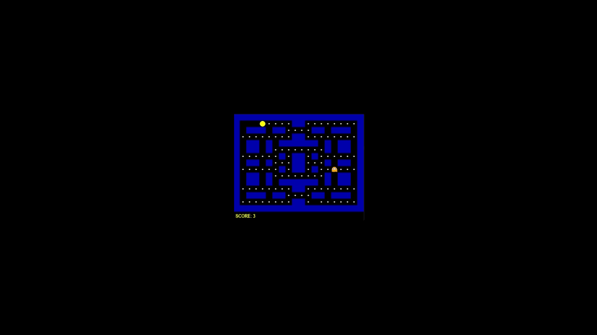
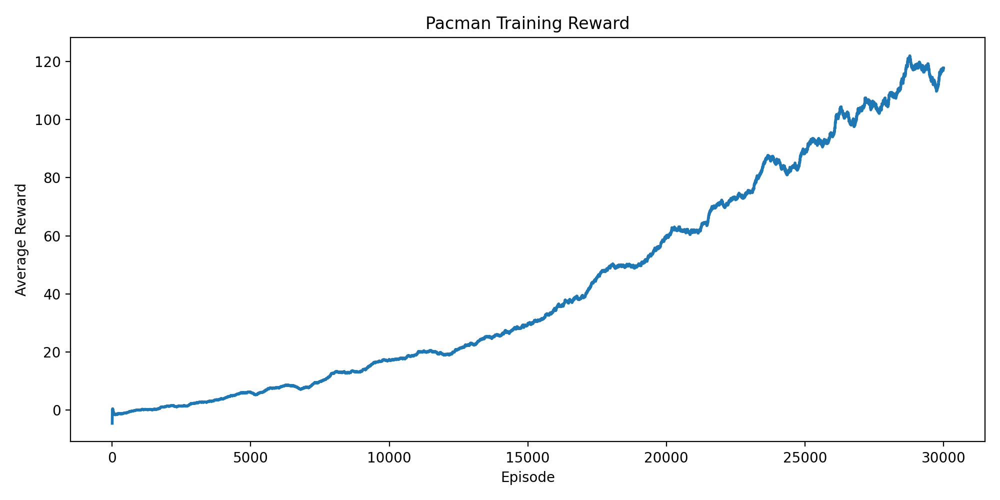

# 🤖 강화학습 기반 Pacman 플레이 모델

**직접 설계한 강화학습 환경**에서 Pacman이 Ghost를 피하면서 모든 Food를 수집하도록 학습하는 Dueling Double DQN 기반 RL 프로젝트입니다.



> **핵심 요약**
>
> * Pacman 게임 환경을 기반으로 직접 강화학습의 State / Action / Reward를 설계했습니다.
> * Agent의 행동을 관찰하며 Reward Shaping과 Action Masking을 적용했습니다.
> * Dueling Double DQN을 적용하여 Pacman Agent를 학습하고 실제 플레이까지 구현했습니다.

---

## 📌 프로젝트 개요

기존 Gymnasium 환경을 사용하는 대신 **Pacman 게임 환경을 직접 구현**하고, 이를 기반으로 강화학습 Agent를 학습했습니다.

단순히 DQN을 적용하는 것에 그치지 않고, 학습 과정에서 Agent의 행동을 관찰하여 발생하는 문제를 분석하고 **Ghost Policy, Action Masking, Reward Shaping** 등을 반복적으로 개선했습니다.

### 프로젝트 목표

* Custom RL Environment 설계
* 안정적인 학습을 위한 Reward 설계
* 불필요한 Action 제거
* Dueling / Double DQN 적용
* 학습된 Agent의 실제 게임 플레이 구현

---

## 🏗️ 시스템 구조

```text
┌─────────────────────────┐
│ Custom Wall / Food Map  │
└────────┬────────────────┘
         ↓
┌─────────────────────────┐
│    Pacman Environment   │
│                         │
│  State / Action /       │
│  Reward / Ghost Policy  │
└────────┬────────────────┘
         ↓
┌─────────────────────────┐
│    Dueling Double DQN   │
│                         │
│  Online Network         │
│  Target Network         │
└────────┬────────────────┘
         ↓
   Pacman Action
         │
         └──────→ Environment
```

---

## 🔧 주요 구현

### 1. Custom RL Environment

20 × 15 크기의 Pacman 환경을 직접 구현했습니다.

환경은 다음 요소를 관리합니다.

* Wall / Food 유무
* Pacman / Ghost 위치
* Action
* State
* Reward
* Episode 종료 조건

Gymnasium의 Custom Environment 구조를 참고하여 `reset()`, `step()`, `_get_obs()` 등의 기능을 구현했습니다.

---

### 2. Ghost Policy

Ghost는 강화학습 Agent가 아닌 **규칙 기반 Policy**로 구현했습니다.

```text
8 Step CHASE
      ↓
2 Step SCATTER
      ↓
8 Step CHASE
      ↓
      ...
```

* **CHASE**: Pacman과의 거리를 줄이는 방향으로 이동
* **SCATTER**: 미리 지정된 위치를 향해 이동
* Wall을 고려하여 이동 가능한 Action만 선택

Ghost의 난이도를 조절하여 학습 초기에 Agent가 충분한 경험을 얻을 수 있도록 설계했습니다.

---

### 3. Action Masking

Pacman 환경에서는 Wall 때문에 이동할 수 없는 Action이 존재합니다.

따라서 Agent가 Action을 선택할 때 **현재 위치에서 이동 가능한 Action만 선택하도록 Action Masking을 적용**했습니다.

DQN이 Q-value를 기반으로 행동을 선택할 때도 불가능한 Action의 Q-value를 제외하여 선택되지 않도록 처리했습니다.

---

### 4. Reward Shaping

단순히 Food를 먹었을 때만 Reward를 주는 방식으로는 Agent가 효율적으로 Food를 수집하지 못하는 문제가 발생했습니다.

학습 중 Agent의 행동을 관찰하면서 다음과 같은 Reward를 추가했습니다.

| Reward              | 목적                   |
| ------------------- | -------------------- |
| `food_reward`       | Food 수집              |
| `clear_reward`      | 모든 Food 수집           |
| `die_penalty`       | Ghost에게 잡히는 행동 억제    |
| `combo_bonus`       | 연속적인 Food 수집 유도      |
| `backtrack_penalty` | 바로 이전 위치로 돌아가는 행동 억제 |
| `visit_penalty`     | 동일 위치 반복 방문 억제       |
| `distance_bonus`    | Food에 가까워지는 행동 유도    |
| `step_penalty`      | 불필요한 행동 및 시간 낭비 억제   |

Reward는 처음부터 완성된 형태로 설계한 것이 아니라, **학습 결과를 관찰하고 문제를 발견한 뒤 필요한 요소를 추가하는 방식으로 개선했습니다.**

---

### 5. Dueling Double DQN

기본 DQN에 **Dueling Network와 Double DQN**을 적용했습니다.

#### Dueling Network

State Value와 Advantage Value를 별도의 Stream으로 분리하여 Q-value를 계산합니다.

```text
              State
                │
         Feature Network
                │
        ┌───────┴───────┐
        ↓               ↓
   Value Stream    Advantage Stream
        ↓               ↓
        └───────┬───────┘
                ↓
             Q Value
```

#### Double DQN

다음 상태에서의 Action 선택과 Q-value 평가를 서로 다른 Network에서 수행합니다.

```text
Online Network
      ↓
Action Selection

Target Network
      ↓
Q-value Evaluation
```

이를 통해 Q-value를 더욱 안정적으로 학습하도록 구성했습니다.

---

## 🧪 문제 해결 과정

### Ghost가 너무 강하면 학습이 어려워지는 문제

초기에는 Ghost의 추적 능력을 높이기 위해 Minimax 알고리즘과 같은 강한 Policy를 적용했지만, 학습 초반 Agent가 충분한 경험을 쌓기 전에 Ghost에게 잡혀 Episode가 종료되는 문제가 발생했습니다.

이를 해결하기 위해 Ghost에 CHASE / SCATTER 모드를 적용하여 일정 시간마다 추적과 분산 행동을 반복하도록 변경했습니다.

→ **Agent가 충분한 경험을 수집할 수 있도록 학습 환경의 난이도 조절**

---

### Agent가 같은 위치를 반복해서 이동하는 문제

학습 과정에서 Agent가 두 위치를 반복해서 왕복하거나 이미 방문한 위치를 계속 탐색하는 현상이 나타났습니다.

이를 해결하기 위해

* `backtrack_penalty`
* `visit_penalty`

를 추가하여 반복적인 행동을 억제했습니다.

---

### Food를 효율적으로 찾아가지 못하는 문제

Food를 먹은 후 다음 Food를 향해 이동하기보다 불필요한 방향 전환을 반복하는 문제가 발생했습니다.

이를 해결하기 위해 **가장 가까운 Food까지의 거리를 이용한 `distance_bonus`**를 추가하여 Food에 가까워지는 행동을 유도했습니다.

---

## 📊 학습 결과

### Training Reward




학습이 완료된 모델을 저장하고, 별도의 실행 코드에서 불러와 실제 Pacman 게임을 플레이하도록 구현했습니다. 최종 플레이 결과는 본문 상단 GIF에서 확인할 수 있습니다.

---

## 📁 프로젝트 구조

```text
Pacman-RL/
│
├── env/
│   ├── gym_env.py
│   ├── GhostPolicy.py
│   ├── Wall_Food_map.py
│   └── utils.py
│
├── models/
│   └── rl_pacman.pth
│
├── train.py
└── run.py
```

| 파일                 | 역할                    |
| ------------------ | --------------------- |
| `gym_env.py`       | Pacman RL 환경          |
| `GhostPolicy.py`   | Ghost 이동 Policy       |
| `Wall_Food_map.py` | Wall / Food Map       |
| `utils.py`         | Action Masking        |
| `train.py`         | Dueling Double DQN 학습 |
| `run.py`           | 학습된 모델 실행             |

---

## ▶️ 실행 방법

### 모델 학습

```bash
python train.py
```

학습 완료 후 모델이 `models/rl_pacman.pth`에 저장됩니다.

### 학습된 모델 실행

```bash
python run.py
```

---

## 💡 배운 점 및 향후 개선

### 배운 점

* 강화학습에서는 특정 Reward가 지나치게 큰 영향을 주지 않도록 **각 Reward 간의 균형을 맞추는 것이 중요**하다는 것을 경험했습니다.
* 학습 결과를 단순한 Reward 수치만으로 판단하기보다 **Agent의 실제 행동을 관찰하여 문제를 분석하는 과정이 중요**하다는 것을 경험했습니다.
* Ghost의 추적 능력을 높였을 시 Agent가 학습에 필요한 경험을 충분히 쌓기 전에 Episode가 종료되는 현상을 보고, Agent가 충분한 경험을 얻을 수 있도록 **학습 환경의 난이도를 조절하는 것이 중요**하다는 것을 경험했습니다.

### 향후 개선

* CNN 기반 State Representation 적용
* Prioritized Experience Replay 및 Multi-step Learning 적용
* 보다 다양한 Ghost Policy 및 난이도 적용
